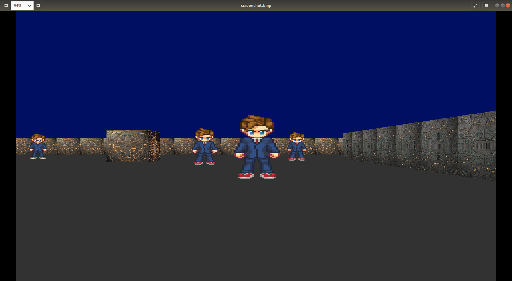

# CUB3D_42

This project is inspired by the world-famous eponymous 90’s game, which was the very first FPS ever : Wolfenstein 3D. The purpose of this project is to learn about raycasting and to make a dynamic view inside a maze in which you will have to find your way. Enjoy this Doctor Who theme !

# Building Mandatory part

``$> git clone https://github.com/lilafallet/CUB3D_42.git ``

``$> cd CUB3D_42``

``$> make``

``$> ./Cub3D resources/map/perfect.cub``

> Editing map : You can change the entire game environment in ressources/map/ .cub file

> Control :

* Moove : WASD (qwerty) or ZQSD (azerty)
* Close the window : ESC key or red cross
* Save a rendered image in bmp format : second argument is "--save"

``$> ./Cub3D resources/map/perfect.cub --save``

# Building Bonus part

``$> git clone https://github.com/lilafallet/CUB3D_42.git ``

``$> cd CUB3D_42``

``$> make bonus``

``$> ./Cub3D resources/map/perfect.cub``

> List of bonus :
* Collision wall
* An HUD
* Life bar
* Collision object
* Earning points/or losing life by picking up objects/traps
* Minimap
* Restart mode
* Advanced key and window's resolution management

> Life bar and minimap

> Lost life

> Restart mode (press R key)

